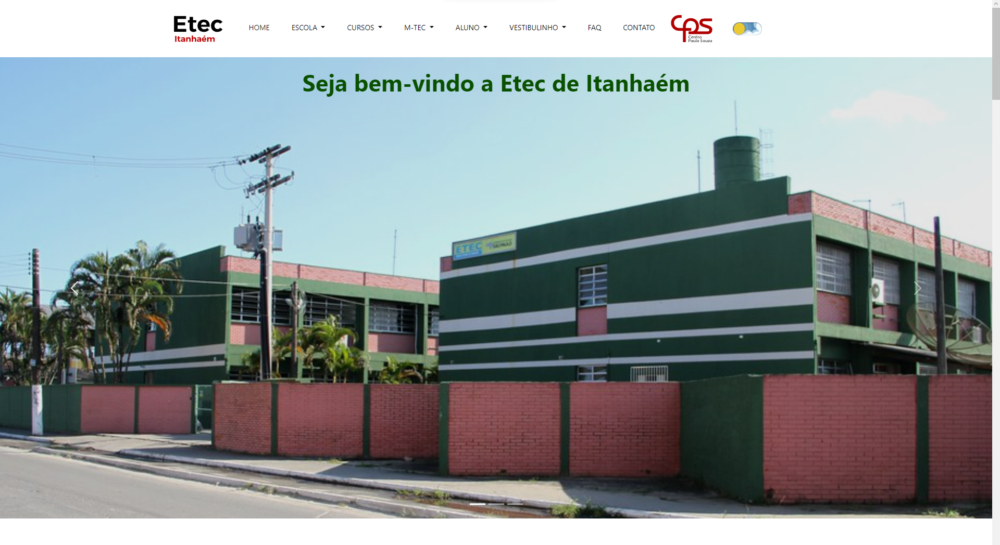
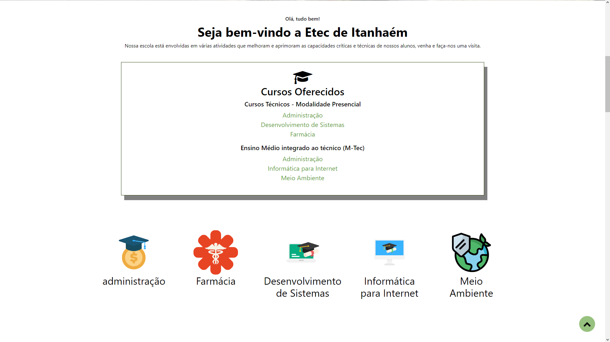

# Escola Técnica Estadual de Itanhaém

Bem-vindo ao site da Escola Técnica Estadual de Itanhaém! Somos uma instituição de ensino comprometida com a formação técnica e profissional de excelência, localizada na encantadora cidade de Itanhaém, no estado de São Paulo.

## Sobre Nós

A Escola Técnica Estadual de Itanhaém é referência no fornecimento de educação técnica de qualidade, oferecendo uma variedade de cursos que preparam os alunos para ingressar no mercado de trabalho. Nossa equipe dedicada de educadores e profissionais está empenhada em proporcionar uma experiência educacional enriquecedora.

## Cursos Oferecidos

Oferecemos uma gama diversificada de cursos técnicos, proporcionando aos alunos a oportunidade de adquirir habilidades práticas e teóricas em diversas áreas. Desde tecnologia da informação até engenharia, nossos programas são desenvolvidos para atender às demandas do mercado de trabalho atual.

- **Desenvolvimento de Sistemas**
- **Farmácia**
- **Administração**

## M-TEC
- **Administração**
- **Informática para Internet**
- **Meio-Ambiente**

## Estrutura e Recursos

Contamos com instalações modernas e equipamentos de última geração, proporcionando um ambiente propício para o aprendizado prático. Nossos laboratórios e salas de aula são projetados para estimular a criatividade e o desenvolvimento profissional dos nossos alunos.

## Atividades Extracurriculares

Na Escola Técnica Estadual de Itanhaém, valorizamos a educação holística. Além dos cursos técnicos, oferecemos uma variedade de atividades extracurriculares que visam enriquecer a experiência educacional dos alunos, promovendo o desenvolvimento pessoal e profissional.

## Como se Inscrever

Se você está interessado em ingressar na Escola Técnica Estadual de Itanhaém, visite nossa página de inscrição online. Estamos comprometidos em facilitar o processo de admissão para garantir que todos os candidatos tenham a oportunidade de explorar seu potencial educacional.

## Fique Conectado

Siga-nos nas redes sociais para ficar atualizado sobre eventos, notícias e realizações da nossa comunidade acadêmica. Estamos ansiosos para recebê-lo em nossa escola e ser parte do seu percurso educacional rumo ao sucesso profissional. 

**Escola Técnica Estadual de Itanhaém - Preparando o Futuro, Transformando Vidas!**
